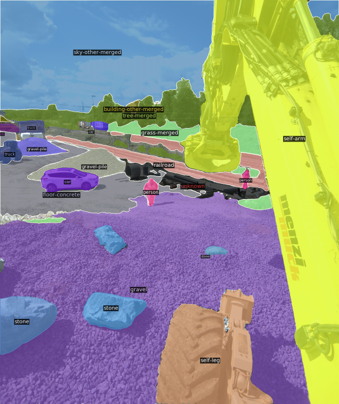

# Panoptic Segmentation using Supervised and Self-Supervised Learning

## Datasets

- COCO Dataset
- Construction site

To generate the datasets, check the README.md in the utils subfolder.

##

## Supervised Baseline 

Supervised Baseline has been established using the Mask2Former framework ([Code](https://github.com/facebookresearch/Mask2Former), [Paper](https://arxiv.org/abs/2112.01527)). 
A Swin Tiny Backbone is chosen to generate a hierarchical feature embedding which is fed to a pixel decoder that creates different feature resolution maps. 
These are given to a hierarchical transformer decoder to produce the panoptic segmentation map. 
The structure is displayed in the title figure.

Datasets included in Training
- Subset of the COCO Dataset (1250 samples)
- Test Construction Site Dataset (255 labeled samples)

A precise description how to train the network and do inference, please see [here](self_sup_seg/m2f_deploy/README.md).

Sample             |  Prediction
:-------------------------:|:-------------------------:
  |  

